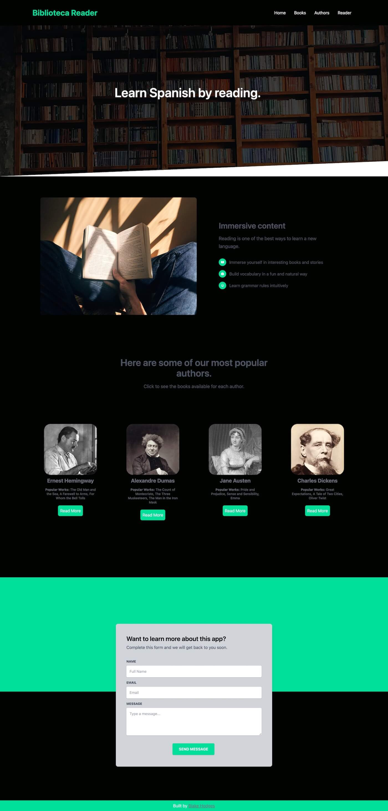
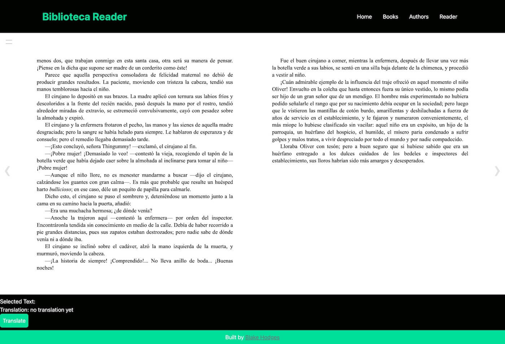

# Biblioteca Reader

A Spanish language learning app that allows you to read ebooks through translation. Web app built with React.js, TailwindCSS, Express.js, and SQLite.




### How I worked on this project

* I used git to track file changes and Github to host my repo.
* I kept up with tasks using a Kanban board on Trello: [Screenshot of tasks](./public/images/trello-board-screenshot.jpg).
* I built this app based on from the Tailwind Starter Kit Landing Page from Tailwind Awesome. [Design PDF](./public/design-files.pdf).
* I deployed the app here http://biblioteca-reader.com using a Digital Ocean Droplet and  Nginx.

#### My goals for this project.
* Be able to read my library of Spanish ebooks in epub format.
* Be able to use the app on different devices.
* Provide click and drag translation from Spanish to English of both words and phrases to aid the reading process.
* Avoid paying for a translation API.

### How to navigate this project

* The Express server and routing are located in the index.js file.
* Views and React components are located in the /src directory.
* This application uses LibreTranslate(https://libretranslate.com/). LibreTranslate is built with python can be set-up using pip or a Docker image, or you can use the paid LibreTranslate translation api.

### Why I built the project this way

* I chose TailwindCSS for this project so that I could speed up the design process and easily add mobile responsiveness to the app.
* I chose React.js for because of its component-based architecture and ability to make simple, quick UI updates.
* I chose Express.js for the web server because it offers features I needed(routing, handling requests and responses) without being bloated with features I didn't need for the project.
* I used SQLite for the app's database so I wouldn't need to run a separate database process and could just interact with the database file using Node.js.
* I chose LibreTranslate to provide clickable/highlight text translation as the user is reading. 


### If I had more time I would change this
* Set up testing as part of the workflow for adding features.
* Use feature branches and Pull requests to add new functionality to the app.
* Improve the production build with more optimization within the Webpack and Babel configuration.
* Integrate the LibreTranslate/argostranslate python library/translation api into the project using npm and node.js.
* Add authentication so users can save reading progress, create their own library, etc.

### Future plans for features
* User can upload their own ebooks.
* Reading progress for each ebook is saved after leaving the site.
* Allow offline reading and translation.
* Improve the production build with more optimization within the Webpack configuration.

### Available Scripts

To set up the project, you can run:

```
npm run build;
```

This will build a production-version of the React front end in /public/src. After the project is built, you can run the Express server to see the front end of the app.


```
npm run dev;
```

This command runs the webpack dev server and watches for changes within /src, so changes can be made without running the build command after each change.


```
npm start;
```
This runs the Express server that serves the React app bundle, static assets, and works with the SQLite database.

More screenshots:




